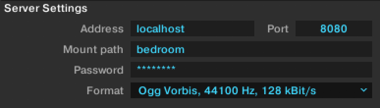

Multiroom pubsub audio stream thing
===================================

This [Liquidsoap](https://github.com/savonet/liquidsoap) + Icecast + Docker-Compose setup lets multiple users cast audio into separate "rooms" via Icecast/Shoutcast, to be listened to by other people.

Features
--------

* Easy Docker Compose setup
* Multiple "rooms" per server, declared in a simple Liquidsoap configuration file
* Automagical saving of livestreamed content

Setup (admins)
--------------

* Copy `multiroom.liq.example` to `multiroom.liq`; configure the room names and passwords as desired.
* Run `docker-compose up`.
* Ensure listeners can connect to port 8000 (which should already show you the Icecast UI), and sources can connect to 8080.

By default, all streams are up all the time; if no one is connected, they just output silence. This could be made optional in a future release.

Setup (sources)
---------------

Use your Icecast client to connect to `server:8080`, source name `ROOMNAME`. Use the password given to you by your friendly server admin.

For instance, for Native Instruments Traktor, if the streaming server is running locally, the setup could be like this:

### Traktor example

Setup (listeners)
-----------------

Navigate to `http://server:8000/` and choose a stream to listen to. You can also use the .m3u links to add to your music player.